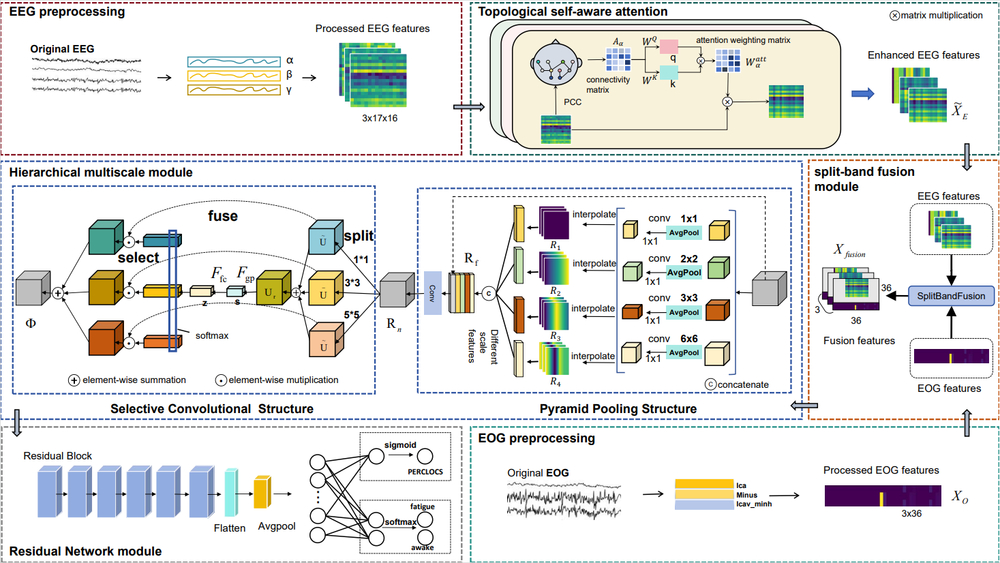

# HMSE-TENet

## Introduction 

This paper proposes a hierarchical multi-scale topology-enhanced network (HMS-TENet).In this network, the topological relationships between EEG channels are investigated by means of a topological self-aware attention module, and the attention weights are generated from the topological relationships.Then the EEG and EOG features are fused in the split-band fusion module, in which it combines the split-band fusion fusion method proposed in this paper to fuse the features of EOG with the features of different frequency bands of EEG respectively.For fusing features, more effective features are obtained by using different scales of receptive fields and sampling sizes on hierarchical multiscale modules.Finally, the final feature extraction is performed in the residual network module then selected to perform classification and regression tasks.

## Requirements
In this folder path, use the CMD command to the terminal, (if it is a virtual environment, please switch first), and then execute the following code to install the dependency package.
```
pip install -r requirements.txt
```
It contains the following five packages.

* numpy==1.26.2
* python==3.9.18
* scipy==1.7.3
* torch==1.8.2

## File and folder contents

* **model.network** : Contains the definition of the network structure of the HMS-TENet network


